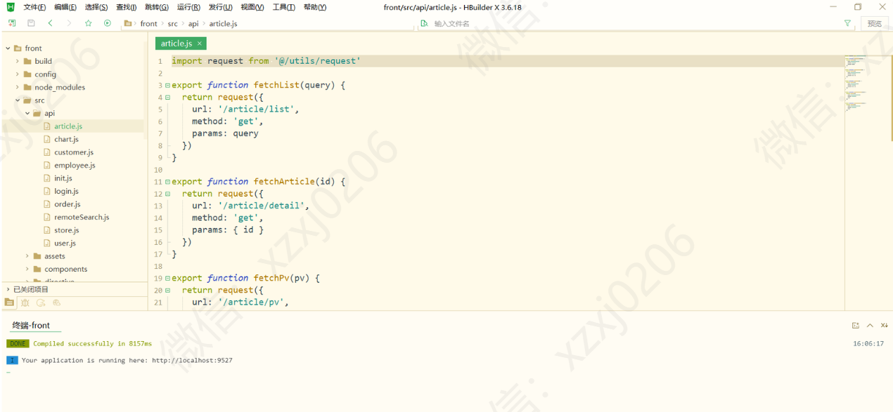
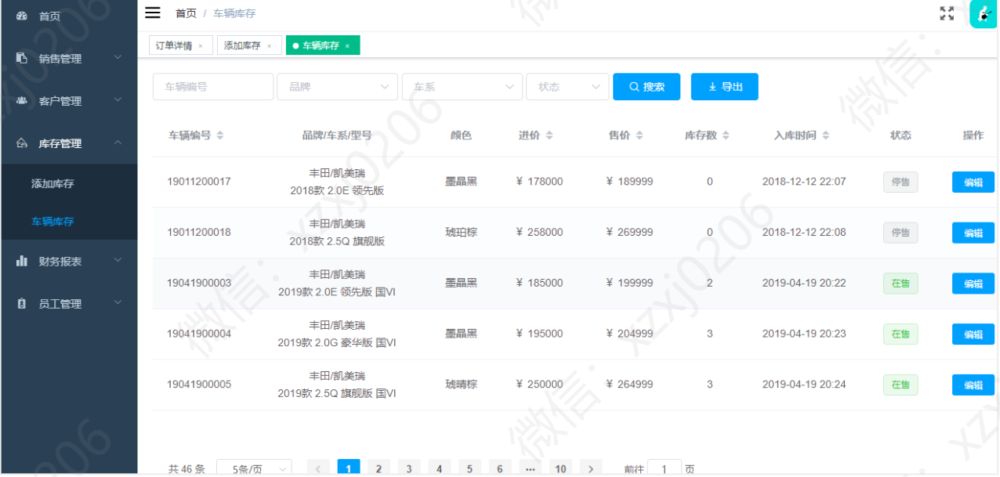
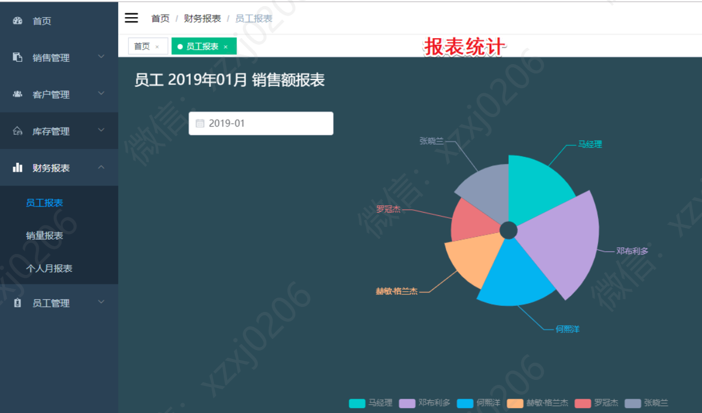
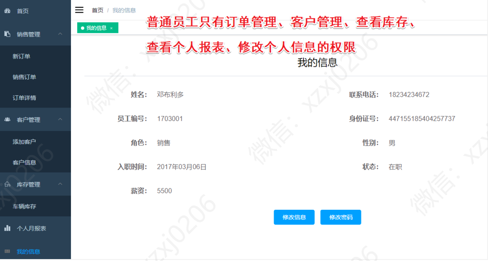

# 汽车销售管理系统

## [基于SSM实现的汽车商城系统](https://github.com/34426/ssm_carstore)

### 有问题，或者不会调试运行的同学, 可以添加微信：xzxj0206

## 一、介绍

### 基于springboot+VUE的汽车销售管理系统

针对汽车销售提供客户信息、车辆信息、订单信息、销售人员管理、财务报表等功能，提供经理和销售两种角色进行管理。

## 二、项目功能介绍

### 1、销售人员功能模块介绍

1、本月销售额统计 2、本月销量统计 3、销售管理(新订单、销售订单、订单详情) 4、客户管理(添加客户、客户信息) 5、库存管理 6、个人月报 7、个人信息

### 2、管理人员功能模块介绍

1、本月销售额统计 2、本月销量统计 3、销售管理(新订单、销售订单、订单详情) 4、客户管理(添加客户、客户信息) 5、库存管理(添加库存、车辆库存) 6、财务报表(员工报表、销量报表、个人月报表) 
7、员工管理(添加员工，员工信息)

### 3、系统运行界面

### 后端运行界面

### 前端运行界面

## 三、管理人员功能模块部分页面展示

## 四、销售人员功能模块部分页面展示

